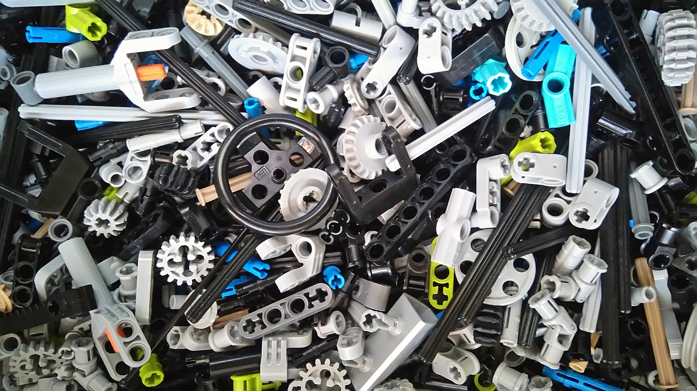

# myworkshop-humanlab-components
Component library to use with My Workshop documentation generator.



## Liens
 * [documentation du projet](https://docs.humanlab.me/myhumankit/myworkshop-humanlab-components/details)

## Fonctionnalités
Ce dépôt GitHub est principalement utilisé pour stocker l'ensemble des informations (documents, modèles 3D, code, plans, etc.) concernant les composants disponibles dans le HumanLab.

Le fichier _project.json_ permet notamment de générer une liste détaillée des composants à l'aide de [myworkshop](https://github.com/myhumankit/myworkshop).

Ce fichier est généré automatiquement en lancant la commande suivant :

```
$ python3 update_component_list.py
```

## Briques technologiques utilisées
 * [myworkshop](https://github.com/myhumankit/myworkshop).

## Gestion de version
La gestion de version repose sur le système [SemVer](http://semver.org/). Voir le fichier [CHANGELOG.md](CHANGELOG.md) pour plus de détails.

## Contribuer
Si vous souhaitez contribuer au projet, merci de créer une _issue_ ou de _forker_ ce projet et de créer une nouvelle branche. Toutes les _pull requests_ sont les bienvenues !

## Licence
Ce projet est diffusé sous la licence MIT. Voir le fichier [LICENSE](LICENSE) pour plus de details.

## Contributeurs
 * **Julien Lebunetel** - [jlebunetel](https://github.com/jlebunetel)

---

# Station de documentation

## Links
 * [Documentation page of the project](https://docs.humanlab.me/myhumankit/myworkshop-humanlab-components/details)

## Features
This very GitHub repository is used to collect all available information (documents, 3D models, code, blueprints, etc.) regarding the components used in the HumanLab.

The _project.json_ file allows the final documentation generation using the tool [myworkshop](https://github.com/myhumankit/myworkshop).

## Technologie used
 * [myworkshop](https://github.com/myhumankit/myworkshop).

## Versioning
We use [SemVer](http://semver.org/) for versioning. See the [CHANGELOG.md](CHANGELOG.md) file for details.

## Contributing
If you'd like to contribute, please raise an issue or fork the repository and use a feature branch. Pull requests are warmly welcome.

## Licensing
The code in this project is licensed under MIT license. See the [LICENSE](LICENSE) file for details.

## Contributors
 * **Julien Lebunetel** - [jlebunetel](https://github.com/jlebunetel)
